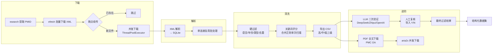

# 马铃薯文献批量下载与清洗系统

基于 NCBI E-utilities API，批量下载 PubMed 中马铃薯相关文献（覆盖胁迫、发育、基因调控、多组学、功能遗传学等方向），
经过解析、去重、质量过滤、关键词评分、LLM 二次验证，最终产出结构化数据集，
用于知识图谱构建或智能体效果评测。

## 特性

- **并发下载** — XML 批次下载自动并发（`ThreadPoolExecutor` + 全局速率限制器），充分发挥 NCBI API 配额
- **三级过滤** — 硬过滤（规则引擎）→ 关键词评分（合并正则单次扫描）→ LLM 验证（多 Provider）
- **断点续传** — XML 批次自动跳过已下载文件；LLM 验证崩溃后可恢复
- **多 Provider** — 支持 DeepSeek、智谱 GLM、OpenAI 兼容 API 三种 LLM 后端
- **数据库复用连接** — 所有批处理操作复用单连接，减少连接开销

## 关于文献格式

PubMed E-utilities 下载的是 **XML 格式的元数据**（标题、摘要、关键词、MeSH词、作者等），
**不是 PDF**。这对后续分析已经足够，因为：
- 90% 的关键信息可从摘要中提取
- XML 结构化程度高，解析准确
- 不存在版权问题，可自由下载

如需全文，PMC 开放获取文章可通过 `--step pdf` 参数额外下载 PDF/TXT。

## 项目结构

```
Potato-Literature-Search/
├── config/
│   ├── __init__.py
│   ├── settings.py              # 全局配置（API Key、路径、搜索词、LLM 配置等）
│   └── .env.example             # 环境变量模板（复制为 .env 后填入密钥）
├── downloader/
│   ├── __init__.py
│   ├── pubmed_downloader.py     # NCBI E-utilities 批量下载 XML（并发 + 速率限制）
│   └── pdf_downloader.py        # PMC OA 全文下载（PDF/TGZ），含重试机制
├── parser/
│   ├── __init__.py
│   └── xml_parser.py            # XML 解析 → SQLite（复用单连接写入）
├── cleaner/
│   ├── __init__.py
│   ├── hard_filter.py           # 硬过滤（语言/摘要/年份/类型/标题/去重）
│   ├── relevance_scorer.py      # 关键词评分（合并正则单次扫描）
│   └── llm_validator.py         # LLM 二次验证（支持 DeepSeek / Zhipu / OpenAI）
├── utils/
│   ├── __init__.py              # now_iso() 工具函数
│   ├── logger.py                # 统一日志
│   └── db.py                    # 数据库工具函数（含四张表）
├── data/
│   ├── raw_xml/                 # 原始 XML 文件
│   ├── processed/               # SQLite 数据库（potato_lit.db）
│   ├── output/                  # CSV 输出 + 清洗报告
│   └── pdfs/                    # 按相关性分级的 PDF/TXT 全文
│       ├── high/
│       ├── mid/
│       └── low/
├── logs/                        # 运行日志
├── tests/                       # 单元测试
├── main.py                      # 一键运行入口
├── requirements.txt
├── AGENTS.md                    # AI 助手开发指南（本地文件，不纳入版本控制）
└── README.md
```

## 流水线架构



> **注意**：`--step all`（默认）仅执行 **下载 → 解析 → 清洗**（硬过滤 + 评分 + 导出 CSV）。
> PDF 下载、LLM 验证、导入复核为独立步骤，需通过对应 `--step` 参数单独执行。

## 快速开始

```bash
# 1. 安装依赖
pip install -r requirements.txt

# 2. 配置 API Key
#    复制 config/.env.example 为 config/.env，填入你的真实密钥
#    .env 已加入 .gitignore，不会误提交

# 3. 运行核心流程（下载 → 解析 → 清洗 → 导出 CSV）
python main.py

#    进阶步骤需单独运行（见下文）

# 4. LLM 二次验证
#    config/settings.py 中 LLM_PROVIDER 可选 "deepseek" / "zhipu" / "openai"
#    对应在 .env 中设置 DEEPSEEK_API_KEY / ZHIPU_API_KEY / OPENAI_API_KEY
python main.py --step validate

# 5. 导入人工复核结果（在导出的 CSV 中标注 Y/N 后）
python main.py --step import-review

# 6. 下载 OA 全文 PDF/TXT
python main.py --step pdf                     # 默认 pdf 格式
python main.py --step pdf --prefer-format txt   # 优先下载纯文本
```

### 单步运行

```bash
# 仅下载 XML（支持断点续传，已存在的批次自动跳过）
python main.py --step download

# 仅解析 XML → SQLite（可指定 XML 目录）
python main.py --step parse
python main.py --step parse --xml-dir data/raw_xml

# 仅清洗（硬过滤 + 关键词评分 + 导出 CSV）
python main.py --step clean

# 仅重新导出 CSV（数据库已有评分时）
python main.py --step export

# 下载 OA 全文 PDF/TXT
python main.py --step pdf
python main.py --step pdf --prefer-format txt

# LLM 二次验证
python main.py --step validate

# 导入人工复核 CSV（自动查找最新复核文件）
python main.py --step import-review
# 指定复核文件
python main.py --step import-review --csv data/output/llm_review_pending_20250101_120000.csv

# 自定义搜索词
python main.py --query "potato AND drought AND gene"
```

### 常用参数速查

| 参数 | 适用阶段 | 说明 |
|------|----------|------|
| `--step` | 全部 | 运行指定阶段（download / parse / clean / export / pdf / validate / import-review / all） |
| `--query` | download / all | 自定义 PubMed 搜索词 |
| `--xml-dir` | parse / all | XML 文件目录（默认 `data/raw_xml/`） |
| `--prefer-format` | pdf | 优先下载格式（pdf / txt，默认 pdf） |
| `--csv` | import-review | 人工复核 CSV 文件路径（默认自动查找最新文件） |

## 输出文件

| 文件 | 说明 |
|------|------|
| `data/processed/potato_lit.db` | 全量结构化文献库（articles + filter_log + relevance_scores + llm_validation 四张表） |
| `data/output/{high,mid,low}_relevance.csv` | 关键词评分三级分类输出 |
| `data/output/clean_report.txt` | 清洗报告（各阶段数量统计） |
| `data/output/llm_review_pending_*.csv` | LLM 验证待人工复核清单（标注 Y/N） |
| `data/output/llm_validation_failed_*.csv` | LLM 校验失败 PMID 清单 |
| `data/output/llm_filtered_*.csv` | LLM + 人工复核后的最终过滤结果 |
| `data/output/failed_downloads_*.csv` | PDF 下载失败链接清单 |
| `data/output/oa_download_links_*.csv` | OA 资源下载链接清单 |
| `data/pdfs/{high,mid,low}/` | 按相关性分级的 PDF/TXT 全文文件 |
| `logs/` | 各模块运行日志（按名称+日期分文件） |
